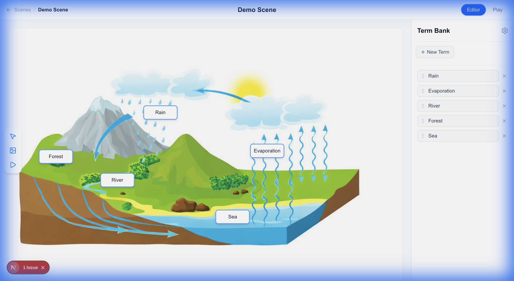
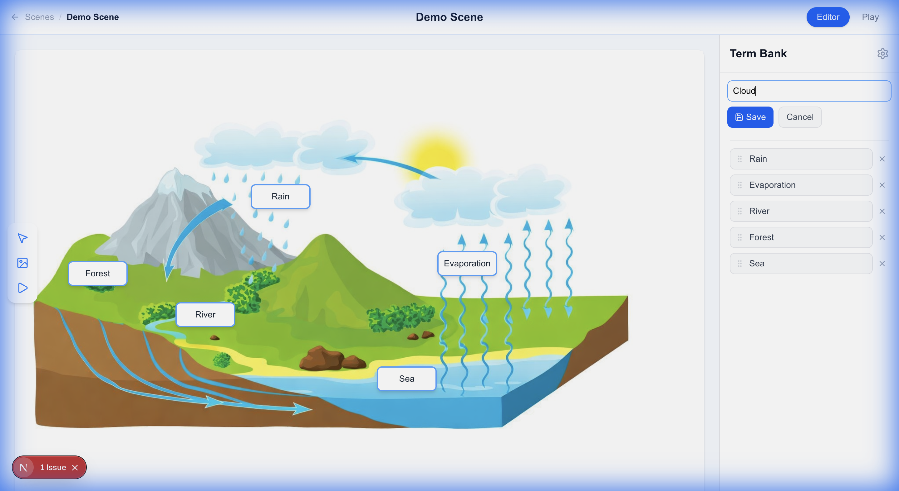
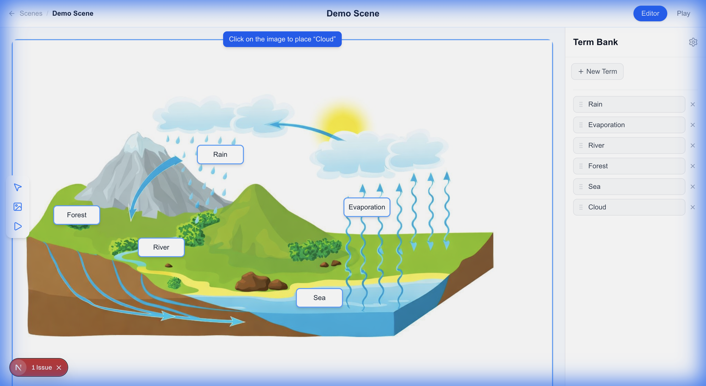
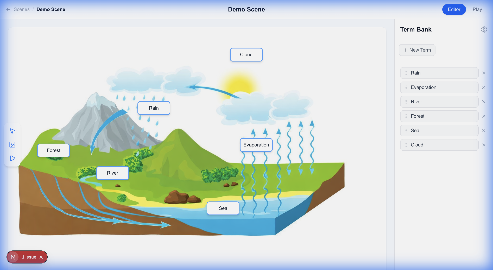
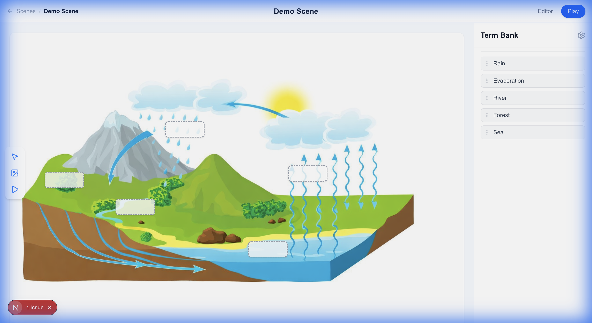

# ScienceClick2 - App Walkthrough

## Overview

ScienceClick2 is an interactive educational tool where teachers create labeled diagram scenes and students learn by dragging terms onto the correct positions. The app has three play modes: **Editor** (for teachers), **Play** (single-player for students), and **Team Match** (two teams compete on the same scene).

## Layout

The app is a full-screen single-page interface divided into three areas:

1.  **Header Bar** (top) — Shows the scene name with a breadcrumb ("Scenes / Demo Scene"), a **Language Switcher** (dropdown), and an Editor/Play mode toggle on the right.
2.  **Canvas** (center) — Displays the scene image with positioned drop targets overlaid on it.
3.  **Word List** (right sidebar, 288px wide) — Lists all terms that can be dragged onto the canvas.



## Editor Mode

Editor mode is the authoring environment where a teacher sets up the scene by creating terms and placing them on the diagram.

### Creating a Term

1. Click the **"New Term"** button in the Word List sidebar.
2. An inline text input appears below the button with a placeholder "Enter term label".


3. Type the term name (e.g., "Evaporation").
4. Click **"Save"** or press **Enter** to confirm. The Save button is disabled until text is entered. Press **Escape** or click **"Cancel"** to discard.
5. After saving, the canvas enters **placing mode**:
   - A blue banner appears at the top of the canvas: *'Click on the image to place "Evaporation"'*.
   - The canvas border turns blue and the cursor becomes a crosshair.
   - Click anywhere on the scene image to place the drop target at that position.


6. Once placed, the term and its drop target are **automatically persisted** to the server. No manual save step is needed.



### How Drop Targets Work in Editor Mode

- Each drop target is a rounded rectangle (128x40px) positioned on the canvas at percentage-based coordinates.
- In editor mode, drop targets display their assigned term label with a solid blue border and white background.
- Every drop target must have exactly one assigned term. Empty drop targets cannot exist.
- Each term maps to exactly one drop target (one-to-one relationship).

### Repositioning a Drop Target

- Drag a term from the Word List onto the canvas background.
- If that term already has a drop target, it moves to the new position.
- The change is automatically persisted.

### Removing a Term

- In editor mode, each term in the Word List has an **X** button on its right side.
- Clicking it removes both the term and its associated drop target from the scene.
- The removal is automatically persisted.

## Play Mode (Single Player)

Play mode is the student-facing experience. Switch to it by clicking **"Play"** in the header bar.

### How It Works

1. All player guesses are **reset** when entering play mode.
2. Drop targets appear as empty dashed-border slots on the canvas (the answer labels are hidden).
3. The Word List sidebar lists all terms. Students drag terms from the sidebar onto drop targets on the canvas.


4. When a term is dropped on a drop target, the target fills in with the term label and shows a solid blue border.


5. Each term can only be placed on one target at a time. Dropping a term on a new target removes it from the previous one.

### Feedback

Feedback is **deferred** — no immediate correct/incorrect indication is given while the student is still placing terms. Once **every** drop target has a term placed on it:

- **Correct** placements turn **green** (green border, light green background).
- **Incorrect** placements turn **red** (red border, light red background).

When all targets are filled:

- If **all correct**: A success message **"All correct! Well done!"** appears in the header with a **"Play Again"** button.
- If **some incorrect**: A message shows the score (e.g., "3 of 5 correct") with a **"Retry"** button to reset and try again.

### Drag Overlay

While dragging a term in either mode, a floating overlay follows the cursor showing the term label in a white card with a blue border.

## Team Match Mode

Team Match is a two-team competitive mode where both teams play the same scene simultaneously on separate devices and see their results compared.

### Starting a Match

Share two URLs with the teams — the only difference is the `team` query parameter:

- **Team A:** `/scenes/{scene-id}?team=team-a`
- **Team B:** `/scenes/{scene-id}?team=team-b`

For example:
```
https://yourserver.com/scenes/water-cycle?team=team-a
https://yourserver.com/scenes/water-cycle?team=team-b
```

When a team URL is opened, the page loads in match mode:
- The team name badge (**Team A** / **Team B**) appears in the header breadcrumb.
- Editor mode is disabled — the page is locked to play mode.
- The Retry button is hidden (no retrying mid-match).

### How It Works

1. Each team drags labels onto drop targets independently on their own device.
2. When a team places all labels, their guesses are **automatically submitted** to the server.
3. The canvas shows a **"Waiting for the other team..."** overlay with a spinner. Dragging is disabled.
4. Both clients poll the server every 2 seconds. When both teams have submitted, the server returns both sets of guesses.
5. Both screens **simultaneously reveal** results:
   - Each drop target shows the team's own answer colored green/red (correct/incorrect).
   - A small badge below each answer shows the rival team's answer for the same target, also colored green/red.
   - The header shows a score comparison: **"Team A: 4/5 vs Team B: 3/5 — Team A wins!"**
   - Confetti fires if the team won or got all correct.

### Starting a New Match

After reveal, a **"New Match"** button appears in the header. Clicking it:
- Deletes the match state file on the server (`match.json`).
- Resets the current team's view so they can play again.
- The other team must also click "New Match" or refresh to start fresh.

### Match State Storage

Match state is stored as `public/scenes/{scene-id}/match.json`. This file is created automatically on the first team's visit and deleted when "New Match" is clicked. Only one match per scene can be active at a time.

## Creating a New Scene

### Step 1: Prepare the Image

The canvas uses a **3:2 aspect ratio** (1200×800 pixels standard). Your source image must be converted to these dimensions.

**Image requirements:**
- **Dimensions:** Exactly **1200×800 pixels** (or any 3:2 ratio — the canvas enforces `aspect-ratio: 3/2`)
- **Format:** PNG is preferred. The app tries these formats in order: `scene.svg`, `scene.png`, `scene.jpeg`, `scene.jpg`
- **Filename:** Must be one of the above (e.g., `scene.png`)
- **No baked-in text labels** — the app renders labels via drop targets; text in the image gives away answers
- **White backgrounds:** Drop target labels have white backgrounds, so they can be hard to see on pure white images. Consider tinting the background (e.g., light blue-gray `rgb(225, 232, 240)`) or setting `"opaqueTargets": true` in the config. Use your judgement based on the specific image.

**Converting a non-standard image to 1200×800:**

If the source image is not 1200×800, use Python/Pillow to scale and pad it:

```python
from PIL import Image

src = Image.open("source-image.png").convert("RGB")

# Scale to fit within 1200x800 without distortion
scale = min(1200 / src.width, 800 / src.height)
new_w, new_h = int(src.width * scale), int(src.height * scale)
resized = src.resize((new_w, new_h), Image.LANCZOS)

# Center on a white (or tinted) canvas
canvas = Image.new("RGB", (1200, 800), (255, 255, 255))
canvas.paste(resized, ((1200 - new_w) // 2, (800 - new_h) // 2))
canvas.save("scene.png")
```

If the image has a white background, replace it with a tint:

```python
import numpy as np
from PIL import Image

img = Image.open("scene.png").convert("RGB")
data = np.array(img, dtype=np.float64)
white_mask = np.all(data > 230, axis=2)
tint = np.array([225, 232, 240])
for c in range(3):
    data[:, :, c][white_mask] = tint[c] + (data[:, :, c][white_mask] - 255)
Image.fromarray(data.clip(0, 255).astype(np.uint8)).save("scene.png")
```

### Step 2: Create the Scene Directory

Create a new directory under `public/scenes/` with a kebab-case ID:

```
public/scenes/my-new-scene/
├── scene.png        # The background image (1200×800)
└── config.json      # The scene configuration (created next)
```

### Step 3: Create config.json

Create `public/scenes/my-new-scene/config.json` with terms and drop targets:

```json
{
  "opaqueTargets": false,
  "terms": [
    {
      "id": "term-example",
      "translations": {
        "en": "Example",
        "it": "Esempio",
        "es": "Ejemplo",
        "fr": "Exemple",
        "wo": "Misaal"
      },
      "defaultLocale": "en"
    }
  ],
  "dropTargets": [
    {
      "id": "target-example",
      "x": 50,
      "y": 50,
      "assignedTerm": "term-example"
    }
  ],
  "agent": "claude"
}
```

**Config rules:**

- **Term IDs:** Use `term-{kebab-case-slug}` (e.g., `term-left-ventricle`)
- **Target IDs:** Use `target-{same-slug}` — must match the corresponding term's slug
- **Translations:** Every term must have all 5 locales: `en`, `it`, `es`, `fr`, `wo`. Use real translations, not the English word repeated.
- **Drop target positioning:**
  - `x` and `y` are percentages (0–100) of the canvas dimensions
  - Position each target near its visual element in the image
  - Minimum spacing: **8 percentage points** apart on at least one axis between any two targets
  - Stay within **5–95%** range for both x and y
  - To calculate: for an element at pixel (px, py) in a 1200×800 image: `x = (px / 1200) × 100`, `y = (py / 800) × 100`
- **`opaqueTargets`:** Set to `true` if the image background is colored (makes drop target backgrounds solid white instead of semi-transparent). Set to `false` or omit for the default semi-transparent look.
- **`agent`:** Optional field indicating who created the scene (e.g., `"claude"`, `"gemini"`)

### Step 4: Add to Gallery Categories (Optional)

To show the scene in a category on the gallery page, edit `src/app/scenes/page.tsx` and add the scene ID to the appropriate `CATEGORIES` entry:

```typescript
{
  label: "Biology & Human Body",
  icon: "🧬",
  sceneIds: [
    "animal-cell",
    "my-new-scene",  // ← add here
  ],
},
```

Scenes not in any category appear under "Other" automatically.

### Step 5: Verify

1. Start the dev server: `npm run dev`
2. Navigate to `/scenes` — the new scene should appear in the gallery
3. Open `/scenes/my-new-scene` — the image should display with drop targets positioned correctly
4. Switch to Play mode and verify all labels can be dragged and scored

## Data Model

### Terms

```json
{
  "id": "term-1770589156675",
  "translations": {
    "en": "Rain",
    "it": "Pioggia",
    "es": "Lluvia",
    "fr": "Pluie",
    "wo": "Taw"
  },
  "defaultLocale": "en"
}
```

- `id`: Unique identifier (kebab-case slug or timestamp-based).
- `translations`: Map of locale codes (en, it, es, fr, wo) to term labels.
- `defaultLocale`: The fallback locale if a translation is missing.

### Drop Targets

```json
{
  "id": "target-1770589159230",
  "x": 38.49,
  "y": 31.87,
  "assignedTerm": "term-1770589156675"
}
```

- `id`: Unique identifier.
- `x`, `y`: Position as percentage of the canvas container (0-100), allowing responsive scaling.
- `assignedTerm`: The `id` of the term assigned to this target (the answer key). Always non-null for persisted targets.

### Player Guesses (runtime only, not persisted)

A `Record<string, string>` mapping drop target id to term id. This tracks what the student has placed where during a play session and is reset each time play mode is entered.

## Persistence

Scene data is stored as JSON files at `public/scenes/{id}/config.json`. A Next.js API route at `/api/scenes/{id}/config` handles reading (GET) and writing (PUT).

Changes are persisted automatically at three points:
1. After a new term's drop target is placed on the canvas.
2. After a term (and its drop target) is removed.
3. After a drop target is repositioned via drag.

Match state is stored at `public/scenes/{id}/match.json` and managed via `/api/scenes/{id}/match` (GET/POST/DELETE).

## File Structure

| File | Purpose |
|------|---------|
| `src/app/scenes/[id]/page.tsx` | Main page component. Manages state for terms, drop targets, player guesses, placing mode, and team match mode. Handles drag-and-drop events and persistence. |
| `src/components/editor/HeaderBar.tsx` | Top bar with scene name breadcrumb, Editor/Play mode toggle, match status display, and team score comparison. |
| `src/components/editor/Canvas.tsx` | Displays the scene image, renders drop targets (DropZone components), handles placing mode click, match waiting overlay, and rival answer badges. |
| `src/components/editor/WordList.tsx` | Right sidebar listing draggable terms, inline term creation form, remove buttons. |
| `src/components/editor/Toolbar.tsx` | Left-side tool palette (placeholder for future tools). |
| `src/app/api/scenes/[id]/config/route.ts` | API route for reading/writing scene config JSON files. |
| `src/app/api/scenes/[id]/match/route.ts` | API route for team match state (GET poll, POST submit guesses, DELETE reset). |
| `src/lib/matchStore.ts` | File-based match state storage (read/write/create `match.json`). |
| `src/lib/i18n.ts` | Term type, supported locales, label resolution with fallback. |
| `src/lib/resultsStore.ts` | In-memory player results storage. |
| `public/scenes/{id}/config.json` | Persisted scene data (terms + drop targets). |
| `public/scenes/{id}/scene.png` | The background image for a scene. |
| `public/scenes/{id}/match.json` | Active match state for team mode (auto-created, deleted on reset). |

## Tech Stack

- **Next.js 16** (React 19) with TypeScript
- **Tailwind CSS** for styling
- **@dnd-kit/core** for drag-and-drop
- **lucide-react** for icons
- **canvas-confetti** for celebration effects
- **i18n** support (English, Italian, Spanish, French, Wolof)
- File-system JSON storage (no database)
